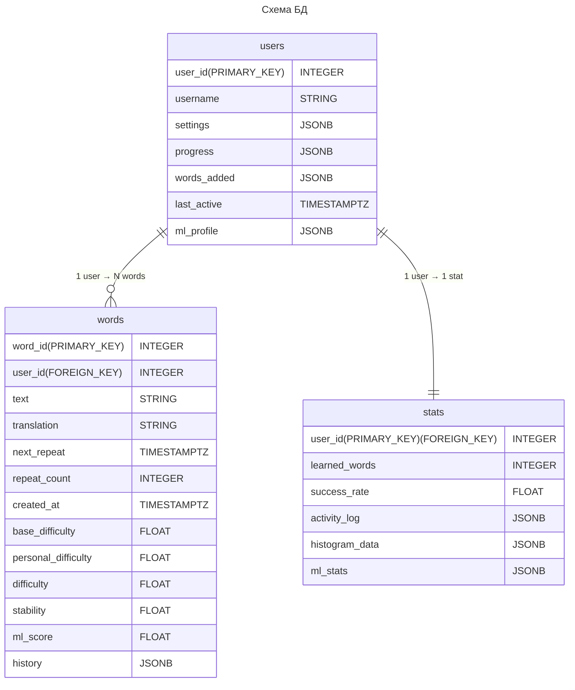

# python-project-2025

# Бот-напоминалка для заучивания иностранных слов

## 1. Описание продукта

Интеллектуальный Telegram-бот для изучения иностранных слов с использованием интервальных повторений, пользовательской статистики и задела под ML-адаптацию сложности. Бот помогает пользователям эффективно запоминать слова, автоматически напоминая о повторениях, отслеживая прогресс и предоставляя персонализированную аналитику.

Проект реализован как асинхронное приложение на Python с использованием `aiogram` и `SQLAlchemy` и хранит данные в PostgreSQL.

### 1.1. Проблема

При самостоятельном изучении слов пользователи сталкиваются с рядом проблем:

- Отсутствие регулярных повторений -> быстрое забывание слов  
- Нет системного подхода (когда и что повторять)  
- Отсутствие статистики прогресса  
- Ручное ведение списков слов неудобно и не масштабируется  

Большинство приложений либо перегружены функционалом, либо не дают прозрачной логики повторений


### 1.2. Идея и цель

Создать Telegram-ассистента, который:

- Сам напоминает, когда повторять слова
- Адаптируется под пользователя
- Хранит историю изучения
- Предоставляет статистику и мотивацию

Ключевые особенности:

- Интервальные повторения — автоматический расчёт следующего повторения
- Асинхронный планировщик — фоновые задачи без блокировок
- Персональные настройки пользователя
- Статистика обучения
- ML-задел — хранение параметров сложности слова и пользователя


## 2. Что видит пользователь

Взаимодействие происходит через Телеграм-бота


### 2.1. Сценарии использования

#### Сценарий 1: Добавить слово
1. Пользователь пишет: 
>/add слово:перевод
1. Бот сохраняет слово в базу данных.
2. Назначается дата первого повторения.
3. В статистику добавляется событие.


#### Сценарий 2: Получить напоминание о повторении
1. Планировщик проверяет, какие слова пора повторить.
2. Бот отправляет уведомление:
> Пора повторить слово: **hello**
3. После отправки рассчитывается следующая дата повторения.


#### Сценарий 3: Посмотреть статистику
1. Пользователь вводит:
> /stats
2. Бот отображает:
- количество выученных слов
- процент успешности
- активность за период


#### Сценарий 4: Посмотреть настройки
1. Пользователь вводит:
> /info
2. Бот отображает текущие настройки:
- количество напоминаний в день
- временная зона
- язык

#### Сценарий 4: Изменить настройки
1. Пользователь вводит:
> /settings число
2. Бот меняет количество напоминаний в день на введенное число


## 3. Архитектура и технологии

### 3.1. Технологический стек

- **Язык:** Python 3.12  
- **Telegram Bot:** `aiogram 3.x`  
- **База данных:** `PostgreSQL`  
- **ORM:** `SQLAlchemy (async)`  
- **Планировщик:** `asyncio` background tasks  
- **ML (задел):**


### 3.2. Архитектура системы

```text
bot/
├── main.py
├── commands/
│   ├── start.py
│   ├── add.py
│   ├── stats.py
│   ├── settings.py
│   └── info.py
│
├── services/
│   ├── database.py
│   ├── scheduler.py
│   ├── parser.py
│   └── notification.py
│
├── models/
│   ├── checker.py
│   ├── user.py
│   ├── word.py
│   └── stats.py
│
├── infrastructure/
│   ├── telegram_io.py
│   ├── docker
│   └── config.py
ml
tests
```
#### Описание структуры проекта

**main.py**  
Точка входа в приложение. Отвечает за запуск Telegram-бота и сервисов, подключение базы данных, инициализацию маршрутизации команд.


### Infrastructure

**I/O операции**  
Слой взаимодействия с внешними системами: отправка и получение сообщений Telegram, чтение и запись данных в базу данных, работа с внешними API.

**docker**  
Отвечает за сборку и упаковку всех компонентов проекта. Обеспечивает воспроизводимую среду запуска (единая версия Python, необходимые библиотеки и зависимости).

**config**  
Хранит конфигурационные параметры приложения: настройки базы данных, токены.


### Services

**parser**  
Разбирает входящие сообщения пользователя (команды и текст), классифицирует их по типу, извлекает параметры и передаёт данные в виде структурированных объектов.

**notification**  
Отвечает за отправку уведомлений пользователю: выбирает подходящее слово для повторения, формирует сообщение и отправляет его пользователю.

**scheduler**  
Выполняет фоновые задачи по расписанию: вызывает сервис уведомлений, запускает алгоритм интервальных повторений, обновляет статистику пользователя.

**database**  
Сервис управления подключением к базе данных и асинхронной работой с данными через репозитории. Отвечает за создание соединений, выполнение запросов, транзакции и передачу данных в доменные модели.

### Models

**User**  
Представляет пользователя Telegram. Хранит настройки пользователя, прогресс обучения, статистику активности и связанные данные.

**Word**  
Описывает изучаемое слово: текст, перевод, связь с пользователем, параметры сложности и историю взаимодействий, используемую для ML-обработки.

**Checker**  
Отвечает за проверку ответов пользователя. Использует эвристики и ML-компоненты для оценки качества ответа и рекомендаций по будущим повторениям.

**Stats**  
Хранит агрегированную статистику пользователя: количество выученных слов, успешность ответов, историю активности и вспомогательные данные для аналитики.

#### Описание моделей проекта:



## 4. Работа команды

### 4.1  Какие задачи необходимо выполнить и сколько времени потребуется на каждую

* Проектирование моделей User, Word, Stats, Checker: 3-4 дня  
* Создание структуры сервиса и модулей: 1 день  
* Реализация базы данных: 3-4 дня  
* Настройка асинхронного планировщика уведомлений (scheduler): 2-3 дня  
* Команды: /start, /info, /stats, /add, /settings: 2-3 дня  
* Парсинг пользовательских сообщений: 3 дня  
* Логика проверки ответов пользователя: 2-3 дня  
* Формирование и генерация ответов пользователю: 1 день  
* Алгоритм интервальных повторений: 4-5 дней  
* Тестирование: 2-3 дня  
* Код-ревью, проверка/слияние PR: 1 день

### 4.2 Распределение обязанностей

**TL:**

* Проектирование моделей User, Word, Stats, Checker  
* Создание структуры сервиса и модулей  
* Код-ревью, проверка/слияние PR

**Developer 1:**

* Команды: /start, /info, /add, /settings  
* Обработка ошибок ввода  
* Генерация ответов пользователю  
* Тестирование команд

**Developer 2:**

* Команда /add  
* Логика проверки ответов  
* ML-фичи, simple ML-модель  

**Developer 3:**

* Настройка scheduler  
* Реализация database
* Парсинг сообщений
* Отправка мотивационных уведомлений
